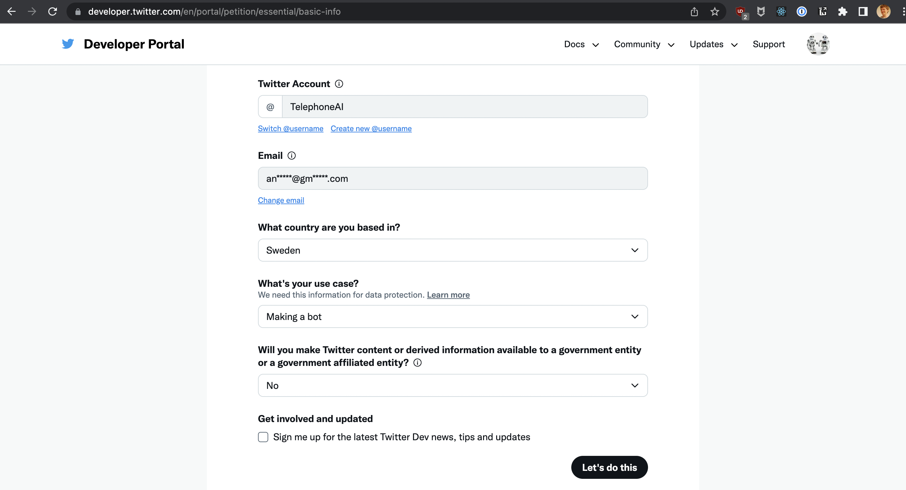
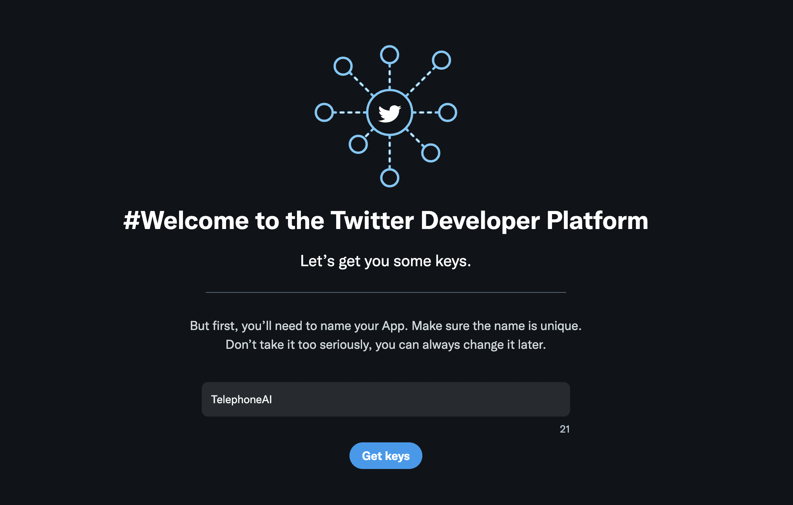
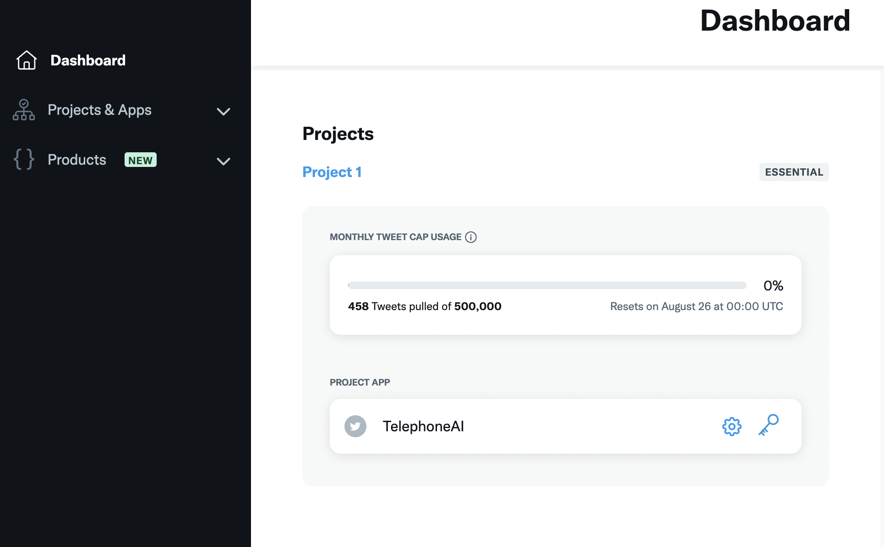
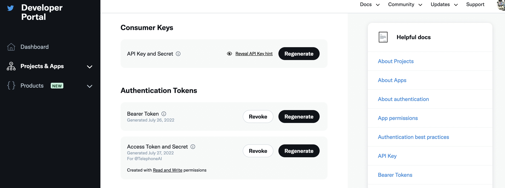
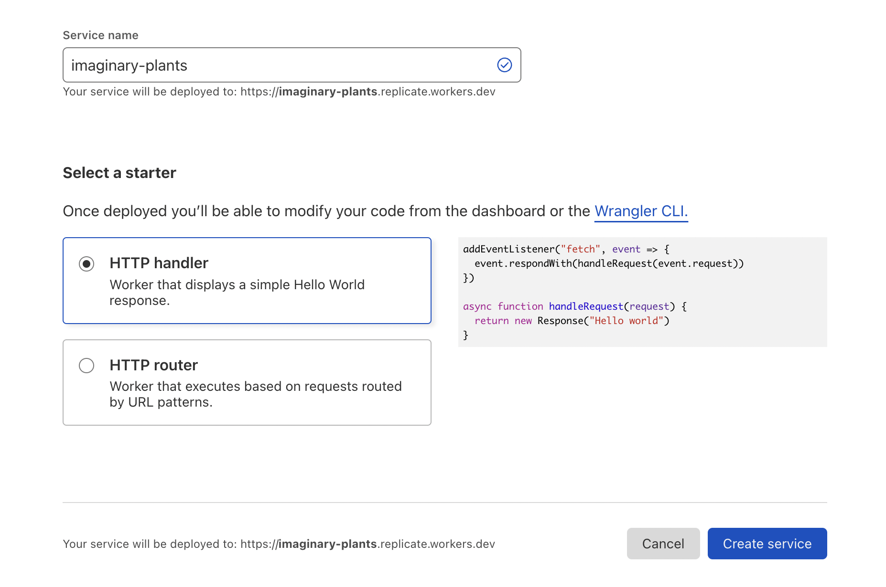
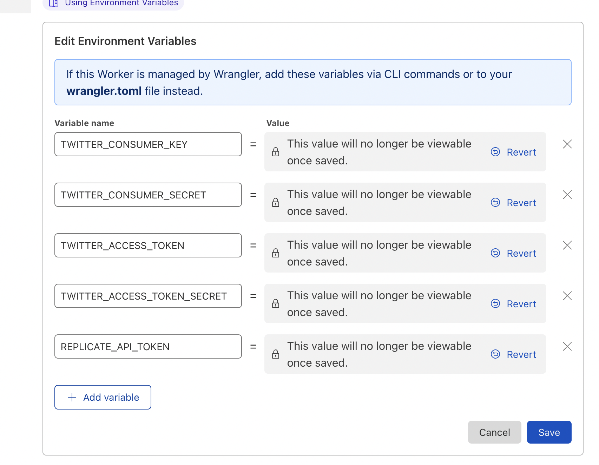
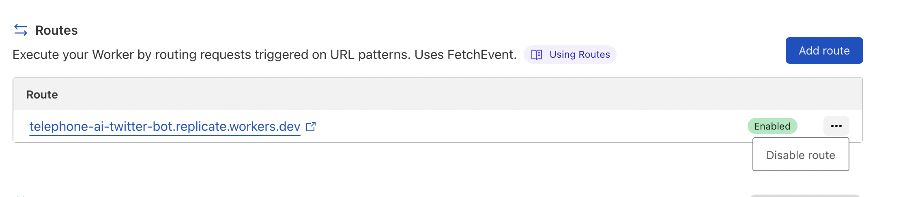
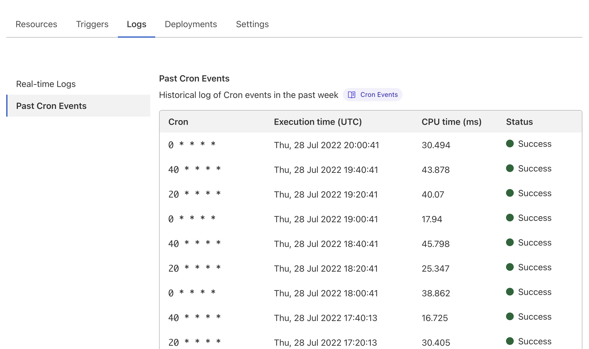

# ai-telephone Twitter bot

🤖 [@TelephoneAI](https://twitter.com/TelephoneAI)

_Two robots playing a game of telephone. One that generates images from captions (using https://replicate.com/kuprel/min-dalle, upscaled by https://replicate.com/jingyunliang/swinir) and one that generates captions from images (using https://replicate.com/j-min/clip-caption-reward)._


## Tutorial: Build a Twitter bot that uses the Replicate API

With ai-telephone as an example project, this tutorial describes how to build a Replicate Twitter bot in JavaScript and deploy it as a scheduled job on CloudFlare Workers. Feel free to copy and paste code from here into your own project!

**Table of Contents**

- [Step 1: Fork this repository and clone it](#step-1-fork-this-repository-and-clone-it)
- [Step 2: Make a new Twitter account for your bot](#step-2-make-a-new-twitter-account-for-your-bot)
- [Step 3: Create a developer account](#step-3-create-a-developer-account)
- [Step 4: Get your Replicate API token](#step-4-get-your-replicate-api-token)
- [Step 5: Make Twitter tokens](#step-5-make-twitter-tokens)
- [Step 6: Make a Cloudflare account](#step-6-make-a-cloudflare-account)
- [Step 7: Install Node.js and npm](#step-7-install-nodejs-and-npm)
- [Step 8: Install wrangler](#step-8-install-wrangler)
- [Step 9: Install project dependencies](#step-9-install-project-dependencies)
- [Step 10: Run the ai-telephone bot locally](#step-10-run-the-ai-telephone-bot-locally)
- [Step 11: Modify the code](#step-11-modify-the-code)
- [Step 12: Make a new service on Cloudflare Workers](#step-12-make-a-new-service-on-cloudflare-workers)
- [Step 13: Copy the API keys to Cloudflare Worker's environment variables](#step-13-copy-the-api-keys-to-cloudflare-workers-environment-variables)
- [Step 14: Publish your worker](#step-14-publish-your-worker)

### Step 1: Fork this repository and clone it

Make your own fork of https://github.com/andreasjansson/ai-telephone-twitter-bot and clone it to your local computer.

### Step 2: Make a new Twitter account for your bot

Go to https://twitter.com/signup and sign up a new account for your bot. You need to be signed out of Twitter for that link to work. You also have to enter a phone number on the settings page: https://twitter.com/settings/phone

Twitter's new rules require you to set a "managing account" for bot accounts. Go to https://twitter.com/settings/account/automation and link your human account, so Twitter doesn't delete your bot.

### Step 3: Create a developer account

Once you have your new bot account set up and you're signed in as that account, go to https://developer.twitter.com/en/portal/petition/essential/basic-info and fill out the form to make yourself a developer account. After you've verified your email address you can create a new app.



At the last step you'll verify your email address. In the verification email is a link that lets you create a new app. Click that link.



At this point you will be presented with an API Key and Secret. Make a new file in the cloned repository called `.dev.vars`. In it, add the API key and secret.

```
TWITTER_CONSUMER_KEY=<api-key>
TWITTER_CONSUMER_SECRET=<secret>
```

### Step 4: Get your Replicate API token

Go to https://replicate.com/account and sign up for the paid plan if you haven't already. You need to be on the paid plan to use the API. Once you've signed up, you can find your API token on your account page.

In `.dev.vars`. In it, add the following line:

```
TWITTER_CONSUMER_KEY=<api-key>
TWITTER_CONSUMER_SECRET=<api-key-secret>
REPLICATE_API_TOKEN=<your-api-token>  # <- new!
```

...where `<your-api-token>` is your Replicate API token.

### Step 5: Make Twitter tokens

Go to the [developer portal](https://developer.twitter.com/en/portal/dashboard) and find your new app. Click the key icon.



Under Authentication Tokens, generate a new Access Token and Secret. Make sure you give them _Read and Write_ permissions. Save these to `.dev.vars`:

```
TWITTER_CONSUMER_KEY=<api-key>
TWITTER_CONSUMER_SECRET=<api-key-secret>
TWITTER_ACCESS_TOKEN=<access-token>  # <- new!
TWITTER_ACCESS_TOKEN_SECRET=<access-token-secret>  # <- new!
REPLICATE_API_TOKEN=<your-api-token>
```

Now you should see the following on the "Keys and tokens" page:



### Step 6: Make a Cloudflare account

We will deploy our Twitter bot on Cloudflare Workers, so you'll need to make a new Cloudflare account and sign up to billing. Go to https://dash.cloudflare.com/sign-up and follow the steps to sign up.

Once you're signed up, you should be able to go to https://workers.cloudflare.com/ and see an empty list of workers.

### Step 7: Install Node.js and npm

If you don't have Node.js and npm installed already, install them. It's easiest via one of the package managers listed on https://nodejs.org/tr/download/package-manager/.

### Step 8: Install wrangler

[Wrangler](https://developers.cloudflare.com/workers/wrangler/) is Cloudflare's CLI tool for interacting with Workers. Install it globally with

```
npm install -g wrangler
```

Then log in to Cloudflare with:

```
wrangler login
```

### Step 9: Install project dependencies

Inside the ai-telephone directory, run this command to install the required dependencies defined in `package.json`:

```
npm install
```

### Step 10: Run the ai-telephone bot locally

Before you start making changes to the bot, run it to make sure all the keys are configured correctly.

To run the bot locally:

```
wrangler dev --local
```

You should now see something like this:

```
▲ [WARNING] Enabling node.js compatibility mode for built-ins and globals. This is experimental and has serious tradeoffs. Please see https://github.com/ionic-team/rollup-plugin-node-polyfills/ for more details.

[...]

[mf:inf] Worker reloaded! (234.32KiB)
[mf:inf] Listening on localhost:8787
[mf:inf] - http://localhost:8787
[mf:inf] Updated `Request.cf` object cache!
```

And you shouldn't see any errors. If you do, open an issue on this repo and we'll fix the documentation!

Visit http://localhost:8787 and watch it create a tweet on your new twitter bot.

### Step 11: Modify the code

Now it's finally time to write some code!

The file `index.js` contains all the code for the bot. It uses plain [fetch](https://developer.mozilla.org/en-US/docs/Web/API/Fetch_API) calls to the Twitter API.

> **Note**
> The Cloudflare Workers environment isn't a fully-fledged Node.js environment, and only [a limited number of npm packages are supported](https://workers.cloudflare.com/works). Notably, none of the Twitter SDKs seem to work, and I had to roll my own.

If you want to add external libraries, check the [list of supported packages](https://workers.cloudflare.com/works) (or test it with trial and error) and install the package with

```
npm install <package-name>
```

💡 What should your bot do? The limit is your imagination! ...and [Cloudflare Worker's resource limits](https://developers.cloudflare.com/workers/platform/limits/). Notably, triggered workers have a [CPU time limit](https://developers.cloudflare.com/workers/platform/limits/#cpu-runtime) of 30 seconds if it's run more frequently than hourly. If it's run less frequently it can use 15 minutes of CPU time. You can add up to three triggers, so you can run long-running jobs every 20 minutes by spreading them out. Note however that CPU time is not wall time, but the docs say that workers have a [higher chance of eviction](https://developers.cloudflare.com/workers/platform/limits/#unbound-usage-model) after 30 seconds.

Test your code locally by again running `wrangler dev --local` and visiting http://localhost:8787.

> **Note**
> If you get stuck or need help with anything, come chat with us in https://discord.gg/replicate.

### Step 12: Make a new service on Cloudflare Workers

Go to https://workers.cloudflare.com and hit _Create a Service_. Give it a name and remember it for Step 14.



It doesn't matter if you make it a "HTTP handler" or "HTTP router" since we'll overwrite their generated code with ours anyway.

### Step 13: Copy the API keys to Cloudflare Worker's environment variables

Click through to your new worker, and go to _Settings_ -> _Variables_. Hit "Edit variables" and add all the variables from `.dev.vars` as environment variables. Make sure to hit the "Encrypt" button on all of them.



### Step 14: Publish your worker

Update the `name` field in `wrangler.toml` to match the name you gave your worker in Step 12. If you want to run it on a different schedule than every 20 minutes, you can change the `crons` field as well.

When you're ready to publish your worker, run

```
wrangler publish
```

If you don't want people to be able to trigger your worker and tweeting things outside of the schedule, you have to manually uncheck the main route for your worker on the _Triggers_ tab on your worker's page on https://workers.cloudflare.com.



You can check the logs of your scheduled runs by going to the _Logs_ tab and viewing _Past Cron Events_.



---

🎉 That's it! You've made a Twitter bot that calls the Replicate API and is deployed on Cloudflare Workers. Let us know what you built in https://discord.gg/replicate!
